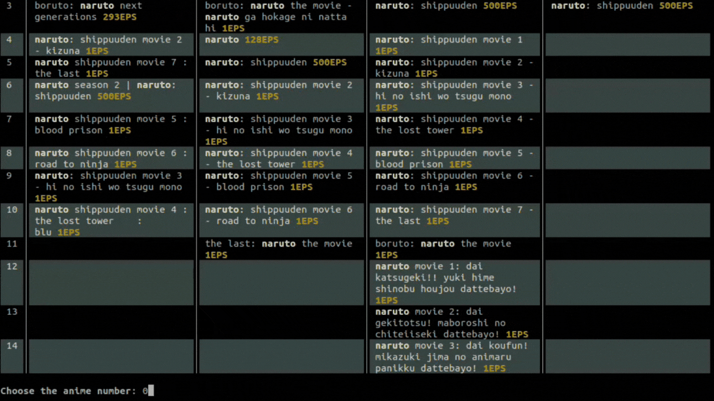

<h1 align="center"></h1>
<p align="center"><sup>A highly efficient, powerful and fast media scraper.</sup></p>

<p align="center">
</p>


<p align="center">Fast download speeds !</p>

</p>

***

## Installation

This project can be installed on to your device via different mechanisms, these mechanisms are listed below in the order of ease.

1.  pipx (recommended)
    _pipx_ is a tool that allows you to install Python CLI applications in an isolated environment. It is recommended to use it to install this project.

    ```sh
    pipx install git+https://github.com/Wadjinny/ArMedia.git
    ```
    You can install _pipx_ using the following command:

    ```sh
    pip install pipx
    ```

2.  Installation from source
    Run the following command:

    ```sh
    git clone https://github.com/Wadjinny/ArMedia.git \
    && cd ArMedia \
    && pip install . \
    && cd ..
    ```

## Usage

After installing ArMedia, you can use it by running the following command:

```sh
armedia --search "search query" 
```

For more information on how to use ArMedia, you can run the following command:

```sh
armedia --help
```
